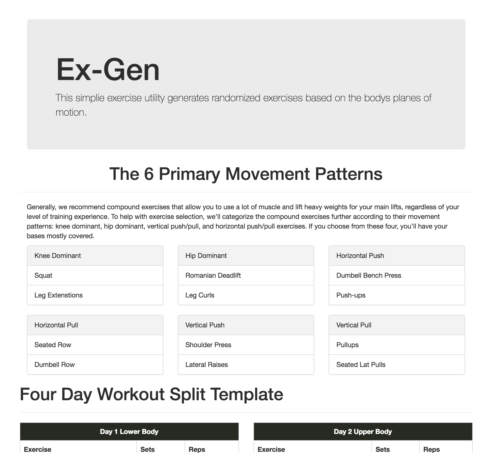

# ExGen
> Easily generate a balanced exercise routine

ExGen is an exercise generator designed around the bodies planes of motion. These workouts emphasize compound movements to ensure all muscle groups are adequately trained.




## Usage
To run locally, first install the necessary dependencies ```yarn``` then start the server ```yarn dev```. Open localhost:8080

## Technologies Used
* React
* Webpack
* ES6
* Bootstrap
* wger API
